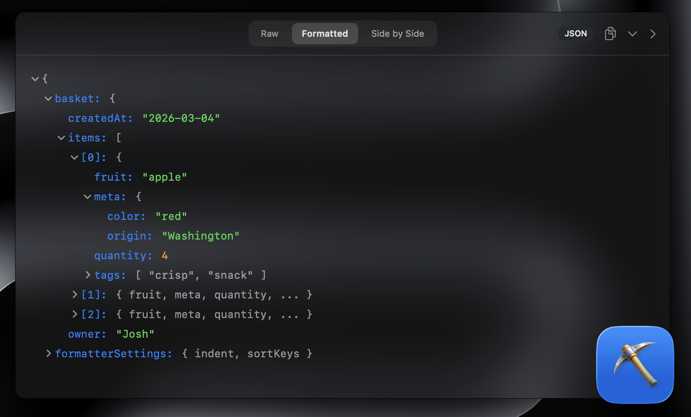

# Refiner

** A macOS app that auto-detects and renders JSON, XML, CSV, Markdown, code, and more.

_Or in other words, an app for data refinement._

[**Download for macOS**](https://github.com/jshchnz/refiner/releases/latest)



## Why Refiner?

You deal with messy text constantly — minified JSON from an API response, raw XML payloads, CSVs from a database export, Markdown you want to make quick edits to. Instead of hunting for an online formatter, pasting into some random website, or writing a quick script, just hit a hotkey. Refiner detects the format automatically and shows you a clean, syntax-highlighted, interactive view instantly.

The long-term goal is to prettify **any** text format. Contributions for new format renderers are very welcome.

## Features

- **Auto-detection** — identifies JSON, XML, CSV, Markdown, Code, and plain text automatically
- **Interactive tree views** — collapsible JSON and XML trees with expand/collapse all
- **CSV tables** — clean grid layout with alternating row highlighting
- **Markdown rendering** — headings, lists, blockquotes, code blocks, inline formatting
- **Code highlighting** — syntax coloring for keywords, strings, numbers, comments
- **Three view modes** — Raw, Formatted, and Side-by-Side (`Cmd+1` / `Cmd+2` / `Cmd+3`)
- **Floating panel** — always-on-top, follows you across spaces
- **Global hotkey** — summon with `Cmd+Opt+R` (customizable)
- **Copy formatted output** — one-click copy of prettified content
- **JSON auto-fix with revert** — automatically repairs malformed JSON, with one-click revert to the original

## Build

No dependencies. Just clone and run.

```
git clone https://github.com/jshchnz/refiner.git
cd refiner/Refiner
open Refiner.xcodeproj
```

Build and run with `Cmd+R`. Requires macOS 14+ and Xcode 15+.

## Contributing

Contributions are welcome — especially new format renderers. If there's a text format Refiner doesn't handle yet, open an [issue](https://github.com/jshchnz/refiner/issues) or submit a PR.

## License

MIT
